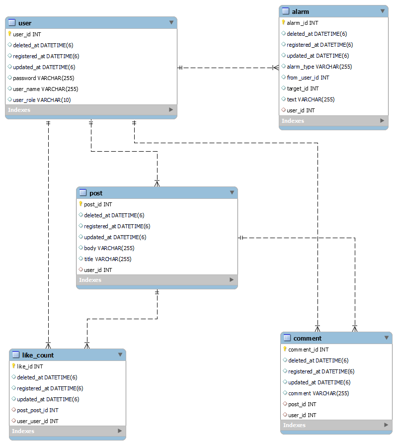

## 프로젝트명 : Mutsa-SNS

프로젝트 기간 : 2022.12.20 ~ 2023.01.10

### ✔ 주요 기능

- 로그인, 회원가입(JWT, Spring Security)
- KAFKA, SOCKET를 활용한 1 대 1 채팅 구현
- 게시글 CRUD
- 댓글 CRUD
- 좋아요 기능
- 알림 기능
- JSP를 활용한 UI
- Soft Delete 적용

### ✔ 기술 스택

- frontend : JSP
- backend : java, spring boot, JPA, spring security, KAFKA
- Database : MYSQL, Redis, MongoDB
- CI/CD : gitlab

### ✔ ERD

### ✔ Endpoint

- [Swagger](http://ec2-54-180-83-38.ap-northeast-2.compute.amazonaws.com:8080/swagger-ui/index.html#/)

| Category | Method | URL                                 | Description       | note                      |
|----------|--------|-------------------------------------|-------------------|---------------------------|
| 회원       | POST   | /users/join                         | 회원가입              | 권한 미필요                    |
|          | POST   | /users/login                        | 로그인               | 권한 미필요                    |
|          | POST   | /users/{userId}/role                | 권한 변경             | 권한 필요                     |
| 게시글      | GET    | /posts                              | 전체 게시글 조회         | 페이징(최신순 정렬), 권한 미필요       |
|          | GET    | /posts/deleted                      | 삭제된 게시글 전체 조회     | 페이징(최신순 정렬), 권한 필요        |
|          | GET    | /posts/my                           | 자신이 작성한 게시글 목록 조회 | 페이징(최신순 정렬), 권한 필요        |
|          | GET    | /posts/{postId}                     | 게시글 상세 조회         | 권한 미필요                    |
|          | POST   | /posts                              | 게시글 등록            | 권한 필요                     |
|          | PUT    | /posts/{postId}                     | 게시글 수정            | 권한 필요                     |
|          | DELETE | /posts/{postId}                     | 게시글 삭제            | 게시글 삭제 시 댓글,좋아요 삭제, 권한 필요 |
| 댓글       | GET    | /posts/{postId}/comments            | 해당 게시글의 전체 댓글 조회  | 페이징(최신순 정렬), 권한 미필요       |
|          | POST   | /posts{postId}/comments/{commentId} | 댓글 등록             | 권한 필요                     |
|          | PUT    | /posts{postId}/comments/{commentId} | 댓글 수정             | 권한 필요                     |
|          | DELETE | /posts{postId}/comments/{commentId} | 댓글 삭제             | 권한 필요                     |
| 좋아요      | GET    | /posts/{postId}/likes               | 좋아요 개수 조회         | 권한 미필요                    |
|          | POST   | /posts/{postId}/likes               | 좋아요 누르기           | 권한 필요                     |
|          | DELETE | /posts/{postId}/likes               | 좋아요 취소            | 권한 필요                     |
| 알림       | GET    | /alarm                              | 알림 조회             | 페이징(최신순 정렬), 권한 필요        |
| 채팅       | GET    | /chatroom                           | 채팅방 생성            | 권한 필요                     |
|          | GET    | /chatroom/{charoomNo}               | 해당 채팅방 연결 끊기      | 권한 필요                     |
|          | GET    | /chatroom/{roomNo}                  | 해당 채팅방 채팅 전체 조회   | 권한 필요                     |
|          | GET    | /chatroom/my-chatroom               | 참여중인 채팅방 조회       | 권한 필요                     |