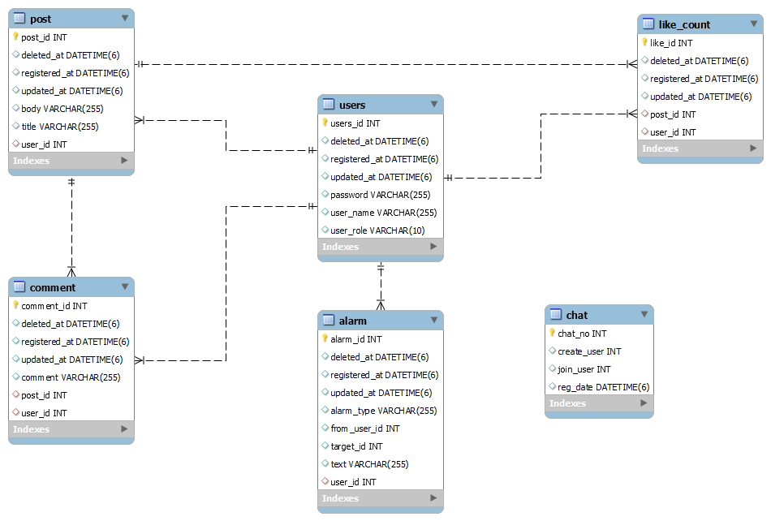
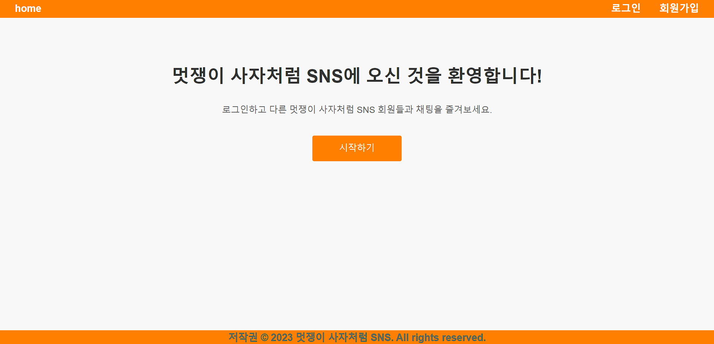
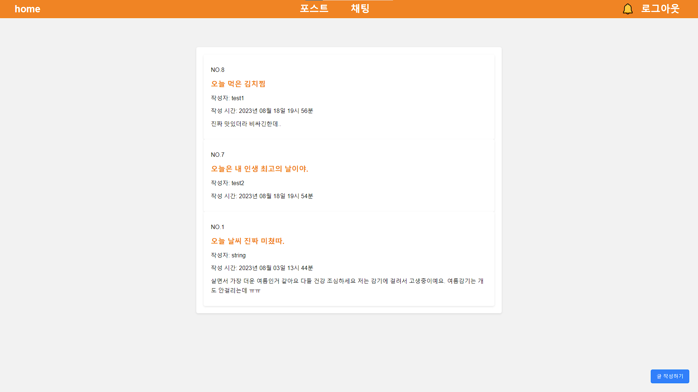
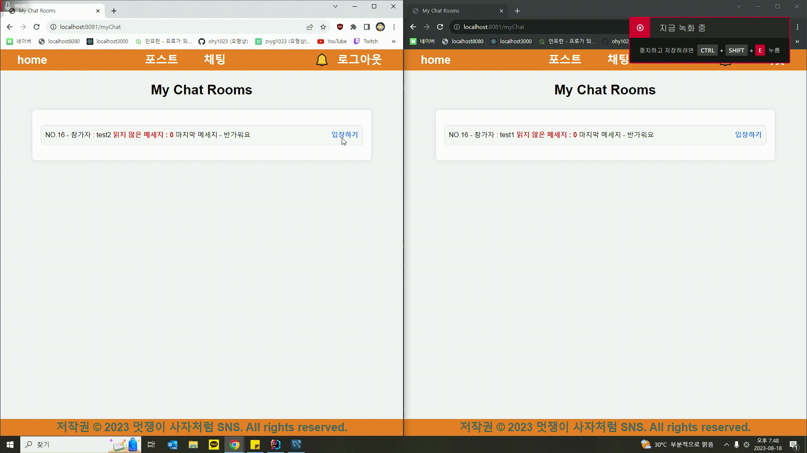

## 프로젝트명 : Mutsa-SNS

프로젝트 기간 : 2022.12.20 ~ 2023.01.10

### ✔ 주요 기능

- 로그인, 회원가입(JWT, Spring Security)
- KAFKA, SOCKET를 활용한 1 대 1 채팅 구현
- 게시글 CRUD
- 댓글 CRUD
- 좋아요 기능
- 알림 기능
- Soft Delete 적용

### ✔ 기술 스택

- frontend : HTML/CSS, Java Script
- backend : java, spring boot, JPA, spring security, KAFKA
- Database : MYSQL, Redis, MongoDB
- CI/CD : gitlab

### ✔ ERD

### ✔ Front

#### home 화면

### 포스트 화면

#### 채팅 화면
 

### ✔ API 명세서

- [Swagger](https://port-0-mutsa-sns-m7plej378a04f632.sel4.cloudtype.app/swagger-ui/index.html#/)

| Category | Method | URL                                 | Description       | note                      |
|----------|--------|-------------------------------------|-------------------|---------------------------|
| 회원       | POST   | /users/join                         | 회원가입              | 권한 미필요                    |
|          | POST   | /users/login                        | 로그인               | 권한 미필요                    |
|          | POST   | /users/{userId}/role                | 권한 변경             | 권한 필요                     |
| 게시글      | GET    | /posts                              | 전체 게시글 조회         | 페이징(최신순 정렬), 권한 미필요       |
|          | GET    | /posts/deleted                      | 삭제된 게시글 전체 조회     | 페이징(최신순 정렬), 권한 필요        |
|          | GET    | /posts/my                           | 자신이 작성한 게시글 목록 조회 | 페이징(최신순 정렬), 권한 필요        |
|          | GET    | /posts/{postId}                     | 게시글 상세 조회         | 권한 미필요                    |
|          | POST   | /posts                              | 게시글 등록            | 권한 필요                     |
|          | PUT    | /posts/{postId}                     | 게시글 수정            | 권한 필요                     |
|          | DELETE | /posts/{postId}                     | 게시글 삭제            | 게시글 삭제 시 댓글,좋아요 삭제, 권한 필요 |
| 댓글       | GET    | /posts/{postId}/comments            | 해당 게시글의 전체 댓글 조회  | 페이징(최신순 정렬), 권한 미필요       |
|          | POST   | /posts{postId}/comments/{commentId} | 댓글 등록             | 권한 필요                     |
|          | PUT    | /posts{postId}/comments/{commentId} | 댓글 수정             | 권한 필요                     |
|          | DELETE | /posts{postId}/comments/{commentId} | 댓글 삭제             | 권한 필요                     |
| 좋아요      | GET    | /posts/{postId}/likes               | 좋아요 개수 조회         | 권한 미필요                    |
|          | POST   | /posts/{postId}/likes               | 좋아요 누르기           | 권한 필요                     |
|          | DELETE | /posts/{postId}/likes               | 좋아요 취소            | 권한 필요                     |
| 알림       | GET    | /alarm                              | 알림 조회             | 페이징(최신순 정렬), 권한 필요        |
| 채팅       | GET    | /chatroom                           | 채팅방 생성            | 권한 필요                     |
|          | GET    | /chatroom/{charoomNo}               | 해당 채팅방 연결 끊기      | 권한 필요                     |
|          | GET    | /chatroom/{roomNo}                  | 해당 채팅방 채팅 전체 조회   | 권한 필요                     |
|          | GET    | /chatroom/my-chatroom               | 참여중인 채팅방 조회       | 권한 필요                     |
|          |        |                                     |                   |                           |

## Trouble Shooting 🚧

[JPA Soft Delete 간단하게 적용하기](https://velog.io/@zvyg1023/Spring-Boot-JPA-Soft-Delete)

[SoftDelete 적용 후 @Where 절로 인해 삭제된 포스트 목록 조회 불가능한 이슈](https://velog.io/@zvyg1023/Spring-Boot-SoftDelete-%EC%A0%81%EC%9A%A9-%ED%9B%84-Where-%EC%A0%88%EB%A1%9C-%EC%9D%B8%ED%95%B4-%EC%82%AD%EC%A0%9C%EB%90%9C-%ED%8F%AC%EC%8A%A4%ED%8A%B8-%EB%AA%A9%EB%A1%9D-%EC%A1%B0%ED%9A%8C-%EB%B6%88%EA%B0%80%EB%8A%A5%ED%95%9C-%EC%9D%B4%EC%8A%88)
